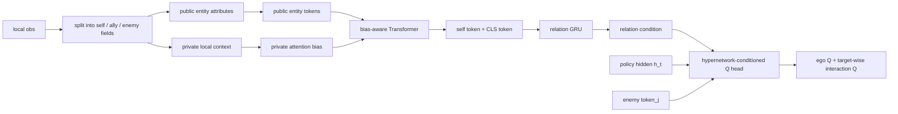

# Private-Bias Public Transformer Model Brief

This file is a GPT-ready research note, not a paper draft. Its purpose is to help ChatGPT or the human author write the method, motivation, ablation, and discussion around the current `private-bias public transformer` model family.

Use this file together with:

- `00_full_research_lineage.md` for project history.
- `00_literature_and_variant_inspiration_map.md` for broader inspiration.
- `02_method_and_code_inventory.md` for older model inventory.

Evidence tags:

- `[repo-confirmed]`: supported by current repository code or material files.
- `[conversation-derived]`: based on prior discussions and experiment interpretation.
- `[inferred]`: logical interpretation of code, model names, and observed results.
- `[needs-human-confirmation]`: should be verified before becoming a paper claim.

## 1. One-Sentence Model Summary

`rpg_public_private_bias_transformer_hypercond` replaces the original RPG-style relation generator with a Transformer that treats objective entity attributes as public tokens and uses observer-dependent local/private context as an attention bias; the resulting relation condition is then used by a hypernetwork-conditioned RPG-style decision head. `[repo-confirmed]`

Suggested paper wording:

> We propose a public-private relation transformer that separates objective entity attributes from observer-dependent local context. Public attributes form entity tokens, while private context modulates token interactions through learned attention biases, producing a relation condition for dynamic local Q-head generation.

## 2. Why This Model Exists

The broad motivation is not simply "use a Transformer" or "use a hypernetwork." The deeper problem is that local observations in cooperative MARL mix heterogeneous semantics: self state, ally state, enemy state, health, shield, unit type, movement feasibility, relative geometry, visibility, and action availability. Feeding all of this directly into a hypernetwork can make the conditioning signal semantically entangled. `[conversation-derived]`

The project's current argument is:

- Raw observations are too coarse as a hypernetwork condition because they mix objective entity state and perspective-dependent interaction context. `[inferred]`
- RPG-style self/ally/enemy decomposition is useful, but RPG's relation pattern and decision maker should not be the whole story; our contribution should focus on how the condition for dynamic head generation is built from observation semantics. `[conversation-derived]`
- The public-private Transformer uses the same underlying observation information more deliberately: public/objective features become entity tokens, while private/subjective features shape which token-token interactions matter. `[repo-confirmed]`
- The downstream decision head remains relation-conditioned, so the model still studies observation-adaptive decision-function generation rather than only feature encoding. `[repo-confirmed]`

## 3. Relationship to RPG

This project inherits several important ideas from RPG-like designs:

- Self/ally/enemy observation decomposition. `[repo-confirmed]`
- Temporal relation hidden state with a GRU. `[repo-confirmed]`
- Structured action-value decision maker with ego-action and interaction-action branches. `[repo-confirmed]`
- Target-wise interaction Q computation over enemies in SMAC. `[repo-confirmed]`

What should not be claimed:

- Do not claim we invented self/ally/enemy decomposition. `[conversation-derived]`
- Do not claim we invented the structured RPG decision maker. `[conversation-derived]`
- Do not claim the whole model is independent of RPG. The decision maker is still RPG-inspired. `[repo-confirmed]`

What can be claimed:

- We change how the relation condition is constructed before hypernetwork-based decision-head generation. `[repo-confirmed]`
- We separate objective entity-token information from observer-dependent private context instead of fusing all observation fields early. `[repo-confirmed]`
- We test whether a relation condition built through private-biased public attention is more effective than the original relation generator and simple public Transformer variants. `[repo-confirmed]`

## 4. SMAC Observation Semantics Used by the Model

Implementation source: `src/modules/agents/clean_hyper_agent.py`, class `PublicTransformerRelationCapturer`. `[repo-confirmed]`

### 4.1 Public Features

In the SMAC public Transformer capturer, "public" means objective entity-state semantics extracted from each agent's local observation. It does not necessarily mean globally shared common information across all agents. `[repo-confirmed]`

Self public token contains:

- Existence constant. `[repo-confirmed]`
- Own health, and shield if enabled. `[repo-confirmed]`
- Own unit type bits if enabled. `[repo-confirmed]`

Ally public tokens contain:

- Ally visible/existence mask. `[repo-confirmed]`
- Ally health, and shield if enabled. `[repo-confirmed]`
- Ally unit type bits if enabled. `[repo-confirmed]`

Enemy public tokens contain:

- Enemy visible/existence mask. `[repo-confirmed]`
- Enemy health, and shield if enabled. `[repo-confirmed]`
- Enemy unit type bits if enabled. `[repo-confirmed]`

Important wording:

- In the paper, call this "objective/public semantic information" or "public-style entity attributes." `[inferred]`
- Avoid saying it is perfectly common knowledge to all agents unless using a specific global-information variant. `[conversation-derived]`

### 4.2 Private Features

Private information means local, observer-dependent, interaction-relevant context. `[repo-confirmed]`

Self private feature:

- The movement/action-availability part before `own_feat`, i.e. `self_feat[:, :, :move_dim]`. `[repo-confirmed]`

Ally private feature:

- The first four ally feature dimensions, used as local geometry/relative interaction context. `[repo-confirmed]`

Enemy private feature:

- The first four enemy feature dimensions, used as local geometry/relative interaction context. `[repo-confirmed]`

Interpretation:

- Public features describe what entities are.
- Private features describe how the current agent sees or can interact with those entities. `[inferred]`

This is the cleanest story for the model:

> Public tokens describe the objective entities in the current local scene; private context decides how these entities should attend to each other from the current agent's perspective.

## 5. SMAC Architecture Flow

Implementation source: `PublicTransformerRelationCapturer.forward`. `[repo-confirmed]`

High-level flow:

Detailed steps:

1. The local observation is split into self, ally, and enemy feature blocks. `[repo-confirmed]`
2. Public features are encoded by separate self/ally/enemy public encoders. `[repo-confirmed]`
3. Private features are encoded by private encoders. `[repo-confirmed]`
4. The Transformer token sequence is `[CLS, self_token, ally_tokens, enemy_tokens]`. `[repo-confirmed]`
5. In the default private-bias mode, private embeddings do not become extra tokens; instead, they construct an attention bias over public entity tokens. `[repo-confirmed]`
6. The Transformer output uses both the encoded `self` token and the `CLS` token. `[repo-confirmed]`
7. `concat(self_out, cls_out)` is passed into a temporal relation GRU. `[repo-confirmed]`
8. The relation hidden state is passed through an output encoder to produce the relation condition. `[repo-confirmed]`
9. The relation condition generates or conditions downstream decision-head parameters. `[repo-confirmed]`

## 6. How the Private Attention Bias Works

Default model: `rpg_public_private_bias_transformer_hypercond`. `[repo-confirmed]`

Default bias construction:

- Encode each private self/ally/enemy component into private tokens. `[repo-confirmed]`
- Form ordered token pairs `(left_private, right_private)`. `[repo-confirmed]`
- Concatenate each pair and feed it to a small MLP to produce per-head attention bias. `[repo-confirmed]`
- Add side-pair bias unless using the `pair_mlp_no_side` ablation. `[repo-confirmed]`
- Insert this pairwise bias into Transformer attention over public entity tokens. `[repo-confirmed]`

Interpretation:

- Public tokens decide what entity information is available.
- Private pair bias changes how strongly entity tokens interact, based on observer-dependent context. `[inferred]`

Known caveat:

- The default implementation still has side embeddings that can distinguish self, ally, and enemy in the public tokens. `[repo-confirmed]`
- The user later argued that public should ideally not distinguish self vs ally, and this motivated friend-merged/private-owner/simple-bias/self-attn-bias variants. `[conversation-derived]`
- For the paper, either state the exact implementation honestly, or use the corrected/friend-merged variant if that is the final chosen model. `[needs-human-confirmation]`

## 7. Downstream Decision Head

For the main SMAC model, the downstream head is still the RPG-style structured decision maker unless using an explicit single-head/token-head ablation. `[repo-confirmed]`

Default downstream structure:

- Policy hidden state `h_t` is produced by the agent's recurrent policy encoder. `[repo-confirmed]`
- Ego-action branch predicts self-action Q-values. `[repo-confirmed]`
- Interaction-action branch predicts target-wise enemy interaction Q-values. `[repo-confirmed]`
- Hypernetwork-generated parameters are conditioned on the relation condition. `[repo-confirmed]`
- Interaction branch additionally uses enemy token information. `[repo-confirmed]`

Important distinction:

- The public-private Transformer generates the relation condition.
- It does not replace the policy recurrent hidden state by default. `[repo-confirmed]`
- Experiments that replace `h_t` with relation tokens are separate token-head ablations, not the main model. `[repo-confirmed]`

## 8. Main Model and Variant Names

### 8.1 Core SMAC Model

`rpg_public_private_bias_transformer_hypercond`

- Public entity attributes become Transformer tokens. `[repo-confirmed]`
- Private local context becomes attention bias. `[repo-confirmed]`
- Relation condition goes into the RPG-style hypernetwork decision maker. `[repo-confirmed]`
- This is the main model family to explain if writing the paper around private-bias public Transformer. `[conversation-derived]`

### 8.2 Baseline Transformer

`rpg_public_transformer_hypercond`

- Uses public entity tokens and Transformer relation generation. `[repo-confirmed]`
- Does not use private bias. `[repo-confirmed]`
- This is the clean ablation for "is private modulation useful?" `[inferred]`

### 8.3 Private Token Alternative

`rpg_public_private_token_transformer_hypercond`

- Adds private embeddings into public tokens rather than using them as attention bias. `[repo-confirmed]`
- Tests whether private information should be fused into token content instead of modulating attention. `[inferred]`

### 8.4 Simpler/Friend-Merged Bias Ablations

`rpg_public_private_bias_friend_public_transformer_hypercond`

- Public side handling merges friendly-side information more aggressively. `[repo-confirmed]`
- Motivated by concern that public features should not over-separate self and ally. `[conversation-derived]`

`rpg_public_private_owner_bias_transformer_hypercond`

- Moves owner/side information into the private side and removes side-pair bias from the pair MLP path. `[repo-confirmed]`

`rpg_public_private_simple_bias_transformer_hypercond`

- Uses a simpler private-bias projection rather than ordered pair MLP bias. `[repo-confirmed]`

`rpg_public_private_selfattn_bias_transformer_hypercond`

- Applies self-attention to private tokens before generating a simple bias. `[repo-confirmed]`

These are useful ablations because they test whether the benefit comes from the high-level public/private separation or from a complicated pairwise bias implementation. `[inferred]`

### 8.5 Target Selection Variants

`rpg_public_private_bias_transformer_topk_hypercond`

- Computes interaction Q-values only for top-k selected enemy targets. `[repo-confirmed]`

`rpg_public_private_bias_transformer_threshold_hypercond`

- Computes interaction Q-values only for targets whose selector score exceeds a threshold, with a fallback target if none are selected. `[repo-confirmed]`

Motivation:

- Target-wise interaction computation can be expensive. `[conversation-derived]`
- Sparse target selection tests whether only a few relevant enemy interactions are needed. `[inferred]`

### 8.6 Delta and Global Variants

`rpg_public_private_bias_past_delta_token_transformer_hypercond`

- Adds past-delta information as token modulation and private context as attention bias. `[repo-confirmed]`
- Preliminary results were inconsistent; do not make this the main claim unless later runs support it. `[conversation-derived]`

`rpg_global_public_private_bias_transformer_hypercond`

- Uses global public information during training. `[repo-confirmed]`
- Prior observations suggested that global public information did not reliably improve and can create train-test mismatch. `[conversation-derived]`

`rpg_global_public_private_bias_transformer_eval_global_hypercond`

- Uses global public information during evaluation too. `[repo-confirmed]`

`rpg_global_public_private_bias_transformer_memory_eval_hypercond`

- Uses a memory-style evaluation variant. `[repo-confirmed]`

Paper stance:

- These are negative or diagnostic ablations unless stronger results appear. `[conversation-derived]`

### 8.7 Relation Token Head Variants

`rpg_public_private_bias_transformer_relation_token_head_hypercond`

- Replaces or changes the head input using relation Transformer tokens. `[repo-confirmed]`

`rpg_public_private_bias_transformer_relation_pair_token_head_hypercond`

- Uses pair-token style information for the decision head. `[repo-confirmed]`

`rpg_public_private_bias_transformer_relation_private_token_head_hypercond`

- Adds private-token style information to the head. `[repo-confirmed]`

`rpg_public_private_bias_transformer_relation_delta_token_head_hypercond`

- Adds delta-token style information to the head. `[repo-confirmed]`

Prior interpretation:

- Replacing policy hidden state `h_t` with relation tokens tended to hurt or destabilize performance, suggesting that relation tokens are better used as a conditioning signal than as a full replacement for recurrent policy state. `[conversation-derived]`

## 9. GRF Extension

Implementation source: `GRFPublicPrivateBiasTransformerCapturer`. `[repo-confirmed]`

GRF variants:

- `grf_public_private_bias_transformer_hypercond`
- `grf_abs_public_private_bias_transformer_hypercond`
- `grf_public_private_bias_transformer_decision_maker_hypercond`
- `grf_abs_public_private_bias_transformer_decision_maker_hypercond`

The compact GRF observation is split into:

- Self position. `[repo-confirmed]`
- Ally positions. `[repo-confirmed]`
- Self direction. `[repo-confirmed]`
- Ally directions. `[repo-confirmed]`
- Opponent positions. `[repo-confirmed]`
- Opponent directions. `[repo-confirmed]`
- Ball features. `[repo-confirmed]`

The absolute-public GRF version reconstructs absolute-style ally/opponent/ball coordinates from ego position plus relative positions. `[repo-confirmed]`

GRF private bias:

- Private features use relative geometry and direction-like context. `[repo-confirmed]`
- These private features generate pairwise attention bias over GRF entity tokens. `[repo-confirmed]`

GRF decision maker:

- Ego branch handles self-control actions. `[repo-confirmed]`
- Ally branch handles pass-like ally interaction actions. `[repo-confirmed]`
- Opponent/goal branch handles opponent or goal interaction actions. `[repo-confirmed]`

Paper stance:

- Treat GRF as an extension/generalization test only if the reproduced GoMARL baseline and our variant are run under matching settings. `[needs-human-confirmation]`
- Earlier GRF runs had environment/config issues and should not be used as final evidence until confirmed. `[conversation-derived]`

## 10. What This Model Is Not

This is not a pure Transformer policy. `[repo-confirmed]`

- The Transformer constructs a relation condition.
- The policy still uses recurrent hidden state `h_t`.
- The Q-head is still hypernetwork-conditioned.

This is not a fully learned discovery of public/private semantics. `[repo-confirmed]`

- The semantic split is manually specified from environment observation layout.
- The paper should call it an environment-semantics-guided inductive bias, not automatic discovery. `[inferred]`

This is not a global-information method unless using global variants. `[repo-confirmed]`

- The main SMAC private-bias public Transformer still operates from local observation.
- "Public" means objective-style fields inside local observation, not necessarily centralized state. `[repo-confirmed]`

## 11. Preliminary Experimental Interpretation

The following points are conversation-derived and should be verified against final W&B exports before appearing as hard paper claims.

Observed trends:

- On `3s5z_vs_3s6z`, `rpg_public_private_bias_transformer_hypercond` showed a promising learning trend compared with some public-only and relation-token variants. `[conversation-derived]`
- `rpg_public_transformer_hypercond` and several relation-token replacement variants often performed worse than the private-bias version. `[conversation-derived]`
- Replacing `h_t` with relation-token inputs in the head degraded performance, suggesting the recurrent policy hidden state remains useful. `[conversation-derived]`
- Global public-information variants did not reliably improve results and may create train-test mismatch. `[conversation-derived]`
- Past-delta token variants were not consistently better; delta information may be useful but the current integration is not clearly reliable. `[conversation-derived]`
- Target-wise interaction computation remains important; target-wise ablations showed the RPG decision maker's per-enemy computation is a strong component. `[conversation-derived]`

Working interpretation:

- The useful part is not "more information" in general.
- The useful part appears to be structured routing of semantic information: objective entity state as tokens, private interaction context as attention modulation, and relation condition as a hypernetwork input. `[inferred]`

## 12. Suggested Ablation Structure

Recommended ablations for the paper:

1. Original RPG-style/linear interaction hypercondition baseline: tests whether the new relation generator improves over the previous strongest baseline. `[conversation-derived]`
2. Public-only Transformer: tests whether public entity tokens alone are enough. `[repo-confirmed]`
3. Public-private token fusion: tests whether adding private info into tokens is better or worse than private-as-bias. `[repo-confirmed]`
4. Public-private bias Transformer: main model. `[repo-confirmed]`
5. Simple/private-owner/self-attn-bias variants: tests whether complicated pairwise bias is necessary. `[repo-confirmed]`
6. Target top-k/threshold variants: tests computation reduction and relevance selection. `[repo-confirmed]`
7. Relation-token head replacement: negative ablation showing that relation tokens should condition the head rather than replace recurrent policy state. `[conversation-derived]`
8. Global public variants: diagnostic ablation for centralized information and train-test mismatch. `[conversation-derived]`
9. GRF extension: optional cross-environment evaluation if settings are validated. `[needs-human-confirmation]`

Recommended maps:

- `5m_vs_6m`: useful sanity/medium map where several variants can learn quickly. `[conversation-derived]`
- `3s5z_vs_3s6z`: more relation-sensitive and useful for demonstrating model differences. `[conversation-derived]`
- `MMM2`: difficult generalization/stress map; useful but expensive. `[conversation-derived]`
- GRF academy tasks: optional, only after original GoMARL reproduction is stable. `[needs-human-confirmation]`

## 13. Safe Claims

These claims are relatively safe if final experiments support them:

- The method separates local observation semantics into objective entity attributes and observer-dependent interaction context. `[repo-confirmed]`
- Public entity attributes are encoded as Transformer tokens. `[repo-confirmed]`
- Private context modulates public-token attention through learned bias rather than being directly concatenated with all features. `[repo-confirmed]`
- The resulting relation condition is used for hypernetwork-conditioned local Q-head generation. `[repo-confirmed]`
- The design is an environment-semantics-guided inductive bias, not automatic structure discovery. `[repo-confirmed]`
- The method is compatible with CTDE because the main version uses local observations at execution. `[repo-confirmed]`

## 14. Unsafe Claims

Avoid these claims:

- "We invent RPG's decision maker." `[repo-confirmed]`
- "Public information is truly shared/common to every agent." `[repo-confirmed]`
- "Global information improves performance." `[conversation-derived]`
- "Delta tokens consistently improve performance." `[conversation-derived]`
- "Replacing the policy hidden state with relation tokens is better." `[conversation-derived]`
- "The method automatically discovers semantic decomposition." `[repo-confirmed]`
- "The method is SOTA across SMAC/GRF." `[needs-human-confirmation]`

## 15. Borderline Claims

These may be true but need stronger evidence:

- "Private attention bias improves over public-only Transformer." Evidence needed: multi-seed comparison on at least `5m_vs_6m` and `3s5z_vs_3s6z`. `[needs-human-confirmation]`
- "The model improves sample efficiency." Evidence needed: area-under-curve or time-to-threshold metrics with matched settings. `[needs-human-confirmation]`
- "Target selection reduces computation without hurting performance." Evidence needed: wall-clock/runtime and performance comparison for top-k/threshold variants. `[needs-human-confirmation]`
- "The method generalizes beyond SMAC." Evidence needed: validated GRF or LBF runs under reproduced baseline settings. `[needs-human-confirmation]`

## 16. Suggested Paper Positioning

A clean contribution structure:

1. Observation semantics are heterogeneous in cooperative MARL.
2. Existing hypernetwork-conditioned MARL often uses agent identity, task embedding, capability descriptors, or raw observation-like inputs as conditions.
3. Raw observation conditions are flexible but semantically entangled.
4. We introduce a public-private observation routing strategy:
   - Objective entity attributes become public tokens.
   - Observer-dependent private context becomes attention bias.
5. The Transformer produces a temporal relation condition.
6. The relation condition generates/adapts local Q-head parameters through the RPG-style decision maker.

Suggested contribution sentence:

> We propose a public-private relation-conditioned hypernetwork architecture that controls how heterogeneous observation semantics enter dynamic decision-head generation: public entity attributes define the relational token space, while private local context modulates token interactions through attention bias.

## 17. Minimal Method Description for GPT

If GPT needs a compact method paragraph, use this:

> For each agent, we first split its local observation into objective entity attributes and observer-dependent private context. Objective attributes, such as health, shield, unit type, and entity existence, are encoded as public self/ally/enemy tokens. Private context, such as local movement and relative interaction features, is encoded separately and used to generate attention biases between entity tokens. A bias-aware Transformer then produces a self-centered relation representation. This representation is passed through a temporal GRU to obtain a relation condition, which is used by a hypernetwork to generate parameters of the local Q-value decision head. The downstream head keeps the RPG-style separation between ego actions and target-wise interaction actions, so the generated decision function can adapt to the current local relation pattern while preserving structured action reasoning.

## 18. Open Questions for Human Author

- Which exact variant should be the final "main model": default `rpg_public_private_bias_transformer_hypercond`, friend-merged, owner-bias, simple-bias, or self-attn-bias? `[needs-human-confirmation]`
- Should the paper describe public/private as "public/private" or "objective/subjective" to avoid overclaiming common knowledge? `[needs-human-confirmation]`
- Which W&B runs are the final validated evidence for `5m_vs_6m`, `3s5z_vs_3s6z`, and `MMM2`? `[needs-human-confirmation]`
- Should GRF be included in the main paper, appendix, or dropped until reproduction is stable? `[needs-human-confirmation]`
- Should target selection be a main efficiency contribution or only an ablation? `[needs-human-confirmation]`
