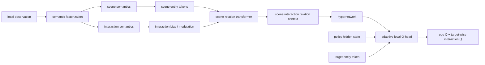

# Scene-Interaction Semantic Story Update

This is a GPT-ready research note. It updates the paper storyline after the project moved away from the earlier `public/private` framing.

Use this file together with:

- `09_private_bias_public_transformer_brief.md` for implementation history and old model names.
- `00_literature_and_variant_inspiration_map.md` for hypernetwork, residual, smoothness, and failed-variant inspirations.
- `02_method_and_code_inventory.md` for code-level model inventory.

Important update:

- The old terms `public` and `private` should be treated as implementation names, not the final paper framing.
- The current paper framing should use **scene semantics** and **interaction semantics**.
- The current model family can be described as a **Scene-Interaction Semantic Hypernetwork**.

Evidence tags:

- `[repo-confirmed]`: supported by current code, config, or material package.
- `[conversation-derived]`: based on project discussion and experiment interpretation.
- `[inferred]`: logical interpretation from model names, implementation, and observed trends.
- `[needs-human-confirmation]`: important but should be verified before paper submission.

## 1. Updated Core Research Question

The current research question should not be written as "we improve GoMARL" or "we add a hypernetwork." `[conversation-derived]`

The stronger question is:

> How should a hypernetwork consume heterogeneous local observations in cooperative MARL, when those observations mix scene configuration and agent-centric interaction opportunities?

The project argues that raw observations are not ideal hypernetwork conditions because they mix different semantic roles. `[conversation-derived]`

In SMAC-like environments, one local observation can simultaneously contain:

- entity identity and type;
- health, shield, and alive state;
- positions, distances, and relative geometry;
- visibility;
- attack availability;
- action availability;
- target-specific interaction information.

Treating all of these as a single flat conditioning vector can make the generated decision head sensitive to irrelevant or semantically entangled variation. `[inferred]`

The new thesis is:

> A hypernetwork-conditioned MARL agent should first organize local observation semantics according to their decision roles. Scene semantics should construct relation context, while interaction semantics should modulate how that context is encoded and used for adaptive Q-head generation.

## 2. New Terminology

Use:

- **scene semantics**
- **interaction semantics**

Avoid using `public/private` as the paper's main conceptual language. `[conversation-derived]`

The repository still contains model names such as `rpg_public_private_bias_transformer_hypercond`; those names are historical implementation names. `[repo-confirmed]`

In the paper, map them as follows:

- `public` implementation components approximately correspond to **scene semantics**.
- `private` implementation components approximately correspond to **interaction semantics**.

This mapping is not perfect, so the paper should describe the final chosen model precisely rather than claiming the code names are semantically exact. `[needs-human-confirmation]`

## 3. Scene Semantics

Scene semantics describe the entities and the current scene configuration. `[conversation-derived]`

They answer:

> What entities are present, and what is the current scene configuration?

Examples include:

- entity type or unit type;
- owner / self / ally / enemy identity;
- health, shield, and alive state;
- position, distance, and relative geometry;
- entity-level state attributes.

Role in the model:

- Scene semantics are encoded as entity tokens.
- These tokens are processed by a relation transformer.
- The goal is to build a structured scene-level relation context.

Important nuance:

- "Scene" does not mean globally observable state.
- "Scene" means entity-state and configuration semantics extracted from the agent's observation.
- This avoids train-test leakage concerns that the old `public` terminology could create. `[conversation-derived]`

## 4. Interaction Semantics

Interaction semantics describe what interactions are currently available, relevant, or feasible from the acting agent's perspective. `[conversation-derived]`

They answer:

> What interactions are currently available or relevant from this agent's perspective?

Examples include:

- visibility;
- attack availability;
- action availability;
- target reachability;
- whether an entity is currently interactable;
- local geometry when it represents agent-centric interaction feasibility;
- observation delta or interaction-change signals, if a delta variant is used.

Role in the model:

- Interaction semantics should not simply be concatenated with scene tokens.
- They should modulate scene relation encoding through attention bias, gating, or another controlled mechanism.
- This lets the model first represent "what the scene is" and then condition attention on "what the current agent can do with it."

This is the conceptual replacement for the old "private-bias public transformer" story:

> interaction-biased scene relation transformer.

## 5. Main Model Story

The current main model family can be described as:

> Scene-Interaction Semantic Hypernetwork for Cooperative MARL.

A possible short name is:

- **SISH**: Scene-Interaction Semantic Hypernetwork.

High-level flow:

1. Split local observation into scene semantics and interaction semantics. `[conversation-derived]`
2. Encode scene semantics into entity tokens. `[repo-confirmed]`
3. Use interaction semantics to produce attention bias or modulation over scene tokens. `[repo-confirmed]`
4. Run a relation transformer to obtain a relation/context representation. `[repo-confirmed]`
5. Feed this representation to a hypernetwork-conditioned local Q-head. `[repo-confirmed]`
6. Use a structured decision head with ego-action and target-wise interaction-action branches. `[repo-confirmed]`

Suggested wording:

> Instead of feeding raw local observations directly into a hypernetwork, we factorize observation semantics into scene semantics and interaction semantics. Scene semantics form entity tokens for relation encoding, while interaction semantics modulate the attention over these tokens. The resulting scene-interaction relation representation conditions a hypernetwork to generate observation-adaptive local Q-heads.

## 6. Relationship to RPG

RPG remains an important technical ancestor. `[conversation-derived]`

The project should not hide this.

RPG-like components inherited or reused:

- self / ally / enemy observation decomposition; `[repo-confirmed]`
- relation-pattern style local context construction; `[repo-confirmed]`
- temporal relation hidden state with a GRU; `[repo-confirmed]`
- structured ego-action and interaction-action Q decomposition; `[repo-confirmed]`
- target-wise enemy interaction Q computation in SMAC. `[repo-confirmed]`

The paper should not claim:

- that we invented self/ally/enemy decomposition;
- that we invented target-wise interaction Q;
- that the model is independent from RPG.

The distinction should be:

- RPG focuses on relation patterns and task-specific decision making.
- Our work focuses on how heterogeneous observation semantics should condition a hypernetwork-generated decision rule.
- Our contribution is scene-interaction semantic organization before hypernetwork conditioning, plus stability-aware dynamic Q-head generation. `[conversation-derived]`

Suggested wording:

> We build on RPG-style structured decision making, but study a different question: how the local observation should be semantically organized before being used as a hypernetwork condition.

## 7. Relationship to HyperMARL and CASH

HyperMARL uses agent identity or learned agent embeddings as hypernetwork conditions. `[conversation-derived]`

This is useful for agent specialization but mostly captures stable agent-specific differences rather than timestep-level local scene changes. `[inferred]`

CASH is closer because it uses capability and local observation to generate adaptive modules. `[conversation-derived]`

However, its condition can still be described as relatively coarse or weakly structured compared with our semantic factorization. `[inferred]`

Our positioning:

- HyperMARL: condition is agent-centric but relatively stable.
- CASH: condition is more dynamic but still mixes heterogeneous observation and capability signals.
- Ours: condition is dynamic and semantically organized into scene and interaction roles.

Safe claim:

> We do not merely add a hypernetwork; we redesign the conditioning signal for hypernetwork-based MARL by separating scene configuration from interaction affordances.

## 8. Interaction-Biased Scene Transformer

The old implementation name `rpg_public_private_bias_transformer_hypercond` should be interpreted as an interaction-biased scene relation transformer. `[conversation-derived]`

Conceptual version:

- Scene tokens carry entity-state/configuration information.
- Interaction semantics generate attention bias or modulation.
- The transformer encodes scene relations under the current agent's interaction perspective.

Why bias/modulation instead of concatenation:

- Concatenation treats all semantics as the same type of information.
- Bias/modulation gives interaction semantics a specific role: controlling which scene relations matter for the acting agent.
- This is cleaner than mixing entity-state and interaction-affordance features inside one token vector. `[inferred]`

This should be the main method figure:



## 9. Stability-Aware Hypernetwork Generation

The second line of innovation is stability-aware dynamic head generation. `[conversation-derived]`

Motivation:

- Hypernetworks generate parameters from conditions.
- If the condition changes slightly but the generated head changes sharply, training can become unstable.
- MARL already has non-stationarity, so uncontrolled parameter generation can worsen optimization.

The project adapts stabilization ideas from hypernetwork literature:

- generate local modules rather than entire networks;
- generate residual updates around a base module;
- regularize hypernetwork outputs;
- control generated parameter scale;
- encourage similar conditions to produce similar dynamic heads.

This should be presented as an adaptation, not as inventing residual/smooth hypernetworks. `[conversation-derived]`

## 10. Stable Head Variants

The current repository includes these stable variants based on the scene-interaction/simple-bias family. `[repo-confirmed]`

### 10.1 Q Residual

Model name:

- `rpg_public_private_simple_bias_transformer_q_residual_hypercond`

Idea:

- Keep a fixed base Q scorer.
- The hypernetwork generates a dynamic Q residual.
- Final Q is approximately:

```text
Q = Q_base + g(z) * Q_dynamic(z)
```

Hypothesis:

- Safer than fully replacing the decision rule because the base scorer remains stable.

Risk:

- The generated residual may be too weak to express useful adaptation.

### 10.2 Parameter Residual

Model name:

- `rpg_public_private_simple_bias_transformer_param_residual_hypercond`

Idea:

- Keep fixed base head parameters.
- The hypernetwork generates a gated parameter residual.

```text
W(z) = W_base + g(z) * Delta W(z)
b(z) = b_base + g(z) * Delta b(z)
```

Hypothesis:

- More principled than Q residual because adaptation occurs at the decision-function parameter level.

### 10.3 Full Head Smooth

Model name:

- `rpg_public_private_simple_bias_transformer_smooth_hypercond`

Idea:

- If two relation/context conditions are close, their generated full heads should be close.

Hypothesis:

- Similar scene-interaction contexts should not produce wildly different decision heads.

Risk:

- Full head smoothness may constrain both stable and adaptive parts, possibly over-regularizing.

### 10.4 Parameter Residual + L2

Model name:

- `rpg_public_private_simple_bias_transformer_param_residual_l2_hypercond`

Idea:

- Penalize the magnitude of the gated residual:

```text
||g(z) * Delta theta(z)||^2
```

Hypothesis:

- Prevents the hypernetwork from over-correcting the base head.

### 10.5 Parameter Residual + Residual Smooth

Model name:

- `rpg_public_private_simple_bias_transformer_param_residual_smooth_hypercond`

Idea:

- Smooth only the dynamic residual part, not the full generated head.

```text
nearby z_i, z_j => g(z_i) Delta theta(z_i) close to g(z_j) Delta theta(z_j)
```

Why this is conceptually cleaner:

- The base head is already shared and stable.
- Only the generated residual should vary with scene-interaction condition.
- Therefore only the residual needs continuity regularization.

### 10.6 Parameter Residual + L2 + Residual Smooth

Model name:

- `rpg_public_private_simple_bias_transformer_param_residual_l2_smooth_hypercond`

Idea:

- Combine residual magnitude control and residual continuity.

Hypothesis:

- This is the strongest stability-aware formulation if both over-adaptation and local discontinuity are problems.

## 11. Current Experimental Interpretation

Existing observations from discussion:

- RPG-style target-wise interaction computation is important; flat interaction heads perform poorly. `[conversation-derived]`
- Replacing the policy hidden state with relation tokens often hurts, so relation representation alone may be insufficient for action-value prediction. `[conversation-derived]`
- Global/full observation training can create train-test mismatch and has not been reliable. `[conversation-derived]`
- Action-edge graph variants are interesting but slow and unstable; they should not be the main story unless later results improve. `[conversation-derived]`
- The scene-interaction transformer family is currently the most coherent paper direction. `[conversation-derived]`
- The stable residual/smooth variants are the natural second contribution because they address a problem created by hypernetwork generation itself. `[conversation-derived]`

## 12. Recommended Ablation Structure

The ablation should isolate two questions:

1. Does semantic organization of the condition help?
2. Does stability-aware hypernetwork generation help?

### 12.1 Semantic Factorization Ablations

Compare:

- RPG-like relation generator baseline.
- scene-only transformer.
- scene + interaction concatenation/token variant.
- interaction-biased scene transformer.
- simple-bias / owner-in-interaction variant if used as final model.

Expected conclusion:

- If interaction-biased scene transformer works better than scene-only and concat/token variants, it supports the claim that interaction semantics should modulate relation encoding rather than be fused naively. `[inferred]`

### 12.2 Head Generation Ablations

Compare:

- base scene-interaction hypernetwork head.
- Q residual.
- parameter residual.
- full head smooth.
- parameter residual + L2.
- parameter residual + residual smooth.
- parameter residual + L2 + residual smooth.

Expected conclusion:

- If residual/smooth improves convergence or stability, it supports the stability-aware generation claim.
- If performance is similar but variance decreases, this can still be useful as a stability result.
- If none help, keep them as negative evidence and do not make them a main contribution. `[needs-human-confirmation]`

### 12.3 Decision Maker Ablations

Use carefully:

- Flat interaction head.
- Target-wise interaction head.
- Relation-token head variants.

Purpose:

- Demonstrate that target-wise interaction computation remains important.
- Avoid claiming this part as a new invention.

## 13. Suggested Paper Contributions

Recommended contribution statements:

1. **Scene-interaction semantic factorization**:
   We propose to factorize local observations into scene semantics and interaction semantics for hypernetwork-conditioned cooperative MARL, reducing semantic entanglement in dynamic head conditioning.

2. **Interaction-biased scene relation encoding**:
   We design a relation transformer where scene semantics form entity tokens and interaction semantics modulate attention, producing an agent-conditioned relation context for adaptive Q-head generation.

3. **Stability-aware dynamic Q-head generation**:
   We introduce residual and smoothness-based stabilization strategies for relation-conditioned hypernetwork Q-heads, encouraging controlled and continuous adaptation.

If residual/smooth experiments do not show strong benefits:

- Make contribution 3 a secondary analysis rather than a main contribution. `[needs-human-confirmation]`

## 14. Safe Claims

Safe or likely safe claims:

- Local observations contain heterogeneous semantics with different roles for decision making. `[conversation-derived]`
- Direct raw-observation conditioning can entangle scene configuration and interaction affordances. `[inferred]`
- Scene semantics and interaction semantics should enter the relation encoder differently. `[conversation-derived]`
- Interaction-biased attention is a structured way to use interaction semantics without naive concatenation. `[repo-confirmed]`
- Hypernetwork-generated decision heads can benefit from residual or smoothness constraints. `[inferred]`

## 15. Unsafe Claims

Avoid:

- "We invent self/ally/enemy decomposition."
- "We are independent of RPG."
- "We automatically discover semantic decomposition."
- "We use no domain knowledge."
- "We solve all hypernetwork instability."
- "We are SOTA on every map."
- "Global information always helps."
- "Interaction bias is universally better than concatenation."

## 16. Borderline Claims Needing Evidence

These claims require stronger experiments:

- "Scene-interaction factorization improves generalization across maps." `[needs-human-confirmation]`
- "Residual smoothness reduces variance across seeds." `[needs-human-confirmation]`
- "The model is competitive with or stronger than RPG on hard maps." `[needs-human-confirmation]`
- "Interaction semantics are better used as bias than as tokens." `[needs-human-confirmation]`
- "The proposed condition is cleaner than CASH-style local observation conditioning." `[needs-human-confirmation]`

Needed evidence:

- multi-seed curves;
- hard-map results;
- scene-only vs interaction-biased comparison;
- concat/token vs bias comparison;
- base hyperhead vs residual/smooth variants;
- runtime/parameter comparison.

## 17. Suggested Introduction Logic

A possible introduction arc:

1. CTDE and parameter sharing improve efficiency but can limit behavior specialization.
2. Hypernetworks offer a compromise by generating adaptive decision modules from conditioning signals.
3. Existing conditioning signals are often agent identity, capability descriptors, or raw/weakly structured observations.
4. In cooperative MARL, local observations are semantically heterogeneous.
5. Raw conditioning mixes scene configuration with interaction affordances, which can produce unstable or noisy generated decision heads.
6. We propose scene-interaction semantic factorization.
7. Scene semantics encode entity relations; interaction semantics bias relation encoding.
8. The resulting relation context conditions a hypernetwork-generated Q-head.
9. To stabilize dynamic head generation, we add residual and smoothness-based generation strategies.

## 18. Suggested Method Section Structure

Recommended method organization:

1. Problem setup and CTDE.
2. Observation semantic factorization:
   - scene semantics;
   - interaction semantics.
3. Interaction-biased scene relation transformer.
4. Relation-conditioned local Q-head generation.
5. Stability-aware hypernetwork generation:
   - Q residual;
   - parameter residual;
   - residual L2;
   - relation/residual smoothness.
6. Training objective with QMIX-style value factorization.

## 19. How to Refer to Implementation Names

The code still uses names like:

- `rpg_public_private_bias_transformer_hypercond`
- `rpg_public_private_simple_bias_transformer_hypercond`
- `rpg_public_private_simple_bias_transformer_param_residual_smooth_hypercond`

In the paper, do not expose these names unless in appendix tables.

Use paper-facing names:

- scene-only transformer;
- interaction-biased scene transformer;
- simple interaction-bias variant;
- Q-residual head;
- parameter-residual head;
- residual-L2 head;
- residual-smooth head.

## 20. Compact Summary for GPT

The current paper should be framed around scene-interaction semantic organization for hypernetwork-conditioned MARL. The central claim is that raw local observations mix scene configuration and interaction affordances, making them poor direct hypernetwork conditions. We factorize observations into scene semantics and interaction semantics, use scene semantics as entity tokens, and use interaction semantics to bias relation-transformer attention. The resulting relation context conditions a dynamic local Q-head. Because dynamic parameter generation can be unstable, we further study residual and smoothness-based stabilization of the generated Q-head. RPG-style target-wise decision making remains an important inherited structure, but the contribution is the semantic conditioning and stability-aware hypernetwork generation around it.

